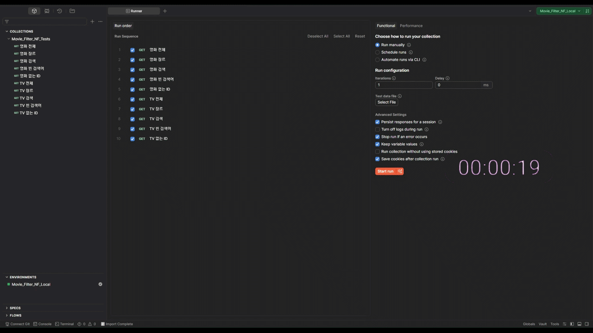

# TMDB 기반 Netflix KR 미디어 API 테스트 자동화 프로젝트

TMDB Open API를 활용하여 한국 Netflix에서 제공되는 영화 및 TV 시리즈 정보를 조회하고,
응답 데이터를 필터·검증하는 API 테스트 자동화 프로젝트입니다.

단순 API 호출 확인이 아니라, 실제 응답 데이터의 품질과 안정성을 검증하는 것에 초점을 맞추었습니다.

또한 실제 API 요청량 증가에 대한 부담을 줄이기 위해 Mock 데이터를 기반으로 테스트 환경을 먼저 구성한 뒤,
최종적으로 실제 API 연동 테스트까지 진행하며 API 자동화 흐름을 학습했습니다.

---

# 테스트 시연 (Demo)

<!-- GIF 또는 이미지 추가 -->

---

# 1. 프로젝트 목적

이전 실무에서는 API 테스트를 Swagger 또는 Postman을 통해 직접 요청하고,
프론트엔드에 응답 값이 정상 반영되는지 확인하는 수준의 수동 테스트만 경험했습니다.
당시에는 Postman이 단순 API 요청 수정 도구라고만 생각했고, API 영역은 자동화 테스트가 가능하다는 것을 알지 못했습니다.

이후 테스트 자동화를 학습하며 UI 자동화뿐만 아니라 API 테스트 자동화 역시 가능하다는 점을 알게 되었습니다.
API 자동화는 반복 테스트와 안정성 측면에서 우선적으로 구성되는 경우가 있다는 점도 알게 되었습니다.
(UI는 인터페이스 변경에 영향을 많이 받지만, API는 규격의 변경이 적어 안정적)

테스트 환경은 진행했던 신용대출 조회처럼 직접 테스트 환경부터 구축하여 자동화를 학습해보자고 계획을 세웠습니다.
그래서 "한국 Netflix에서 제공되는 콘텐츠만 검색할 수 있는 서비스"를 기획하고 본 프로젝트를 시작하게 되었습니다.

---

# 2. 프로젝트 소개

TMDB Open API를 활용하여
한국 Netflix에서만 제공되는 영화 및 TV 시리즈 데이터를 조회할 수 있도록 구성했습니다.

조회된 데이터는:
* 제목(title)
* 장르(genre)
* 평점(vote_average)
* 줄거리(overview)

정보를 기반으로 가공되며,
장르 선택 여부에 따라 데이터 정렬 방식이 달라지도록 구현했습니다.

## 주요 기능

### ✅ Netflix KR 제공 콘텐츠 필터링

TMDB Watch Provider 데이터를 기반으로, 한국 Netflix에서 제공 중인 콘텐츠만 필터링합니다.

> ※ 실제 Netflix 요금제(광고형/베이식/프리미엄)별 제공 콘텐츠 정보는 TMDB에서 제공하지 않아 일부 차이가 발생할 수 있습니다.
> ※ TMDB에서 제공하는 원본 언어 데이터를 기준으로 일부 콘텐츠 제목이 현지화되지 않은 상태로 반환될 수 있습니다.

---

### ✅ 영화 / TV 시리즈 분리 조회

- 영화
- TV 프로그램

탭별로 데이터를 분리하여 조회합니다.

---

### ✅ 장르별 필터링

총 13개의 장르 데이터를 기반으로:

- 장르 선택 시 → 평점 기준 정렬
- 장르 미선택 시 → TMDB 기본 순서 유지

방식으로 데이터를 가공합니다.

---

### ✅ TOP 20 데이터 노출

가공된 데이터 중 상위 20개 콘텐츠만 노출되도록 구성했습니다.

---

### ✅ 데이터 정규화 및 예외 처리

응답 데이터 내:

- overview null 값 처리
- 존재하지 않는 ID 요청
- 빈 검색어 입력
- 평점 데이터 검증

등의 예외 상황을 검증하도록 구성했습니다.

---

# 3. QA 관점에서 검증한 부분

이번 프로젝트에서는
단순 API 응답 성공 여부보다 “응답 데이터 품질”을 중요하게 확인했습니다.

특히 아래 부분들을 중점적으로 검증했습니다.

### 응답 상태 코드 검증

- 정상 요청 → 200
- 빈 검색어 → 400
- 미존재 ID → 404

---

### 필수 데이터 존재 여부 확인

- 제목(title)
- 장르(genre)
- 평점(vote_average)
- 줄거리(overview)

필수 데이터가 정상 반환되는지 검증했습니다.

---

### 평점 데이터 검증

TMDB 평점 데이터가 정상적으로 반환되는지 확인했습니다.

또한 장르 선택 시:

- 평점 기준 내림차순 정렬
- 데이터 유실 여부

를 함께 검증했습니다.

---

### null 데이터 처리 검증

overview 값이 null인 경우에도:

- UI 노출 오류
- 문자열 처리 오류
- 데이터 가공 오류

가 발생하지 않도록 정상 정규화 처리 여부를 검증했습니다.

---

## 예외 케이스 검증

실제 업무에서도 규격 외 값을 입력했을 때 프론트엔드가 정상적으로 처리하지 못하는 경우를 경험한 적이 있었습니다.

이번 프로젝트에서도 “실제 자주 발생하진 않지만, 방어할 수 있다면 미리 확인해보자”는 생각으로 예외 상황 테스트를 함께 구성했습니다.

### 검증한 예외 케이스

| 케이스               | 기대 결과      |
| ----------------- | ---------- |
| 빈 검색어 입력          | 400 반환     |
| 존재하지 않는 ID 조회   | 404 반환     |
| null 데이터           | 빈 문자열로 정규화 |
| 장르 미선택            | 기본 정렬 유지   |

---

# 4. Mock 데이터를 먼저 사용한 이유

처음에는 실제 TMDB API만 사용하여 자동화를 구성하려고 했습니다.

하지만 테스트 흐름을 수정하는 과정에서 API 요청이 반복적으로 발생했고,
계속되는 요청으로 인해 호출 제한이나 통신 문제가 생길 수 있겠다는 생각이 들었습니다.

그래서 실제 API 응답 구조와 동일한 Mock 데이터를 먼저 구성하여:
* 테스트 흐름 검증
* 데이터 가공 로직 확인
* 예외 상황 테스트

를 먼저 진행해보며 안정화 시킨 뒤,
최종적으로 실제 API 통신 환경에서 동작을 검증하는 방식으로 진행했습니다.

이 과정을 통해 API 자동화에서는
호출뿐만 아니라 테스트 환경 자체를 안정적으로 관리하는 것이 필요하다는 것을 경험할 수 있었습니다.

---

# 5. API 테스트를 하며 느낀 점

UI 테스트는 화면에서 보이는 동작을 기준으로 테스트 흐름을 따라갈 수 있었지만,
API 테스트는 눈에 보이지 않는 데이터 흐름을 기준으로 검증해야 한다는 점이 가장 크게 다가왔습니다.

특히:
* 응답 데이터 누락
* 잘못된 데이터 포함
* null 데이터 처리
* 요청량 증가에 따른 영향

등 UI 테스트에서는 상대적으로 덜 경험했던 부분까지 고려하게 되면서,
QA가 단순 화면 동작뿐 아니라 데이터 안정성까지 함께 봐야 한다는 점을 체감할 수 있었습니다.

또한 실제 서비스에서 사용되는 외부 API 데이터를 검토하는 과정에서
데이터 신뢰성과 정책 기준까지 고려해야 한다는 점도 경험했습니다.

자동화 마지막 단계에서 성인 콘텐츠 필터 기능을 추가하려 했지만,
외부 API의 연령등급 데이터가 국가별 기준과 완전히 일치하지 않는다는 점이 확인되었고,
하드코딩으로 강제로 만들기보다 실제 서비스에서 신뢰 가능한 정책 기준으로 사용할 수 있는지 먼저 검토하는 과정이 필요하다는 것을 알게되었습니다.

---

# 6. API 수동 테스트 대비 느낀점

수동 테스트는:

- 정해진 규격
- 제한된 시나리오
- 반복적인 확인 작업

위주로 진행되는 경우가 많았습니다.

반면 API 자동화에서는:

- 규격 외 데이터 입력
- 다양한 예외 케이스 구성
- 데이터 정렬 및 가공 검증
- 백엔드 응답 안정성 확인

등을 반복적으로 검증할 수 있었습니다.

특히:

- Mock 데이터
- 실제 API 데이터

를 함께 활용하면서:

UI에서는 보이지 않는 영역까지 테스트할 수 있다는 점이 API 테스트 자동화의 가장 큰 장점이라고 느꼈습니다.

---

# 7. 프로젝트 구조

```text
MOVIE_FILTER_NF/
├── app/                        # FastAPI 백엔드 애플리케이션 코어
│   ├── templates/              # 프론트엔드 HTML 템플릿 레이어
│   │   ├── detail.html         # 미디어 상세 페이지
│   │   └── index.html          # 메인 및 검색 페이지
│   ├── main.py                 # 애플리케이션 진입점 및 API 라우터
│   └── tmdb_client.py          # TMDB API 연동 및 데이터 가공 처리 모듈
│
├── images/                     # 프로젝트 문서화용 이미지 자산
│   └── API_Test_Automation.gif # 테스트 자동화 시연 GIF
│
├── tests/                      # API 검증 및 테스트 자동화 스위트
│   ├── api_objects/            # API 요청 및 검증 로직 분리 레이어
│   │   ├── movie_api.py        # 영화 API 요청 및 검증 메서드
│   │   └── tv_api.py           # TV 시리즈 API 요청 및 검증 메서드
│   ├── conftest.py             # Pytest 공통 Fixture 및 테스트 환경 설정
│   ├── test_api.py             # Mock 데이터 기반 API 검증 테스트 케이스
│   ├── test_real_api.py        # 실제 TMDB API 연동 검증 테스트 케이스
│   └── Movie_Filter_NF_Tests.postman_collection.json # Postman API 테스트 컬렉션
│
├── .env                        # TMDB API Key 환경 변수 파일
├── check_adult.py              # TMDB 성인 콘텐츠 데이터 검증 및 실험용 스크립트
├── pytest.ini                  # Pytest 실행 및 테스트 환경 설정
├── README.md                   # 프로젝트 소개 및 실행 가이드
└── requirements.txt            # 프로젝트 의존성 라이브러리 목록
```

---

# 8. 기술 스택

| 구분            | 사용 기술       |
| -------------- | -------------- |
| Language       | Python         |
| Framework      | FastAPI        |
| Test Framework | Pytest         |
| Async Test     | pytest-asyncio |
| API Client     | httpx          |
| API Tool       | Postman        |
| Data Format    | JSON           |
| Environment    | python-dotenv  |
| External API   | TMDB Open API  |
| Test Data      | Mock Data      |

---

# 9. 설치 및 실행

## 설치

```bash
pip install -r requirements.txt
```

---

## 서버 실행

```bash
uvicorn app.main:app --reload
```

---

## 테스트 실행

```bash
# Mock 기반 테스트 실행
pytest tests/test_api.py -v

# 실제 API 연동 테스트 실행
pytest tests/test_real_api.py -v
```
```bash
# Postman Collection 실행
Pytest 기반 자동화 테스트 외에도,
Postman Collection을 함께 구성하여 API 요청 및 응답 데이터를 직접 확인할 수 있도록 구성했습니다.

tests/Movie_Filter_NF_Tests.postman_collection.json
tests/MOVIE_FILTER_NF_LOCAL.postman_environment.json

2개 파일을 Postman에 Import 후 실행할 수 있습니다.
* 테스트를 정상적으로 수행하려면 Postman에 아래 환경 변수(Environment) 세팅이 필요합니다.
* 불러온 환경 변수 창의 **Value** 항목에 값을 입력해야 정상적으로 인식됩니다.
```
| Variable (변수명) | Value 설명 | Value 예시값 |
| :--- | :--- | :--- |
| `baseUrl` | 로컬 백엔드 서버 주소 | `http://127.0.0.1:8000` |
| `movie_search_query` | 영화 검색어 | `펄` |
| `tv_search_query` | TV시리즈 검색어 | `오` |

---

# 10. 마무리

이번 프로젝트는 단순 API 호출 테스트보다는
- 외부 API 데이터를 어떻게 가공하고
- 어떤 기준으로 검증하며
- 어떤 예외 상황까지 고려해야 하는지

를 학습하기 위해 진행한 프로젝트였습니다.

아직 작은 규모의 API 자동화이지만, 실제 데이터를 기반으로
- 응답 검증
- 데이터 품질 확인
- 예외 처리
- 통신 구조 고려

까지 경험해보며, QA는 기능 동작뿐 아니라 데이터 안정성과 백엔드 영역까지 함께 이해해야 한다는 점을 다시 느낄 수 있었습니다.
